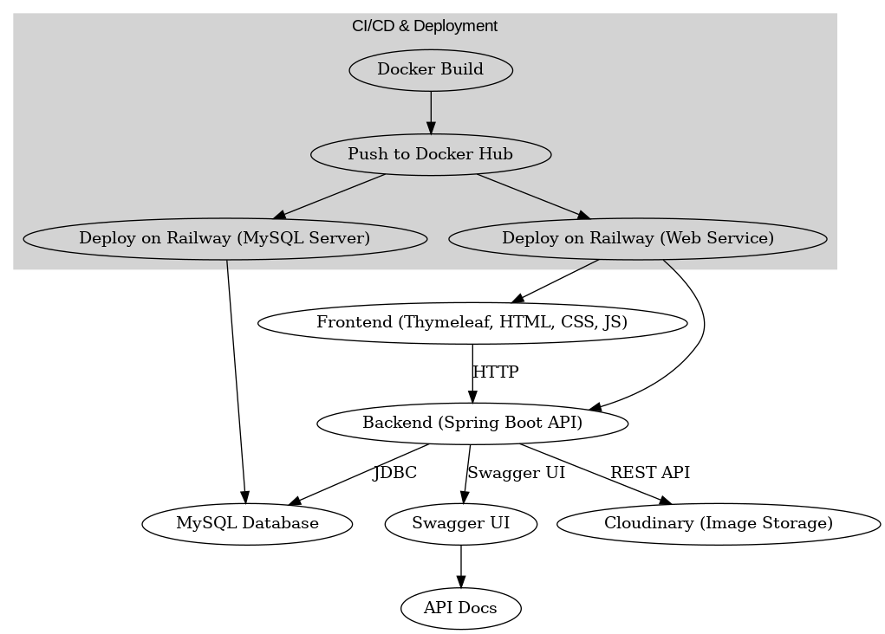

# GreenTea E-commerce App

Welcome to Beui Tea Shop! This is a modern tea shop web application using **Java Spring Boot** (backend), **Thymeleaf** (frontend), **MySQL** (database), and **Cloudinary** (for product image storage).

---

## 1. Overall Architecture



- **Frontend**: User interface, rendered dynamically with Thymeleaf (HTML, CSS, JS).
- **Backend**: Handles business logic, REST APIs, JWT authentication, user roles, image upload to Cloudinary, and database connection.
- **MySQL Database**: Stores products, orders, users, and other business data. Deployed as a managed service on Railway.
- **Cloudinary**: Stores product images; backend uploads images directly to Cloudinary and saves the URL to the DB. No local image storage.
- **API Docs (Swagger UI)**: Auto-generated API documentation for backend endpoints.
- **CI/CD & Deployment**: The app is containerized using Docker, images are pushed to Docker Hub, and deployed on Railway (both web service and MySQL server).

---

## 2. Local Setup with Docker Compose

### Requirements
- [Docker](https://www.docker.com/) & Docker Compose
- (Optional) WSL if you use Windows

### Steps

1. **Clone the repo:**
   ```bash
   git clone https://github.com/Quyen190400/ecommerceApp.git
   cd ecommerceApp
   ```
2. **Configure environment variables:**
   - Create a `.env` file (to override defaults), for example:
     ```env
     SPRING_DATASOURCE_URL=jdbc:mysql://beui-mysql:3306/greenteashop?useUnicode=true&characterEncoding=utf8mb4&serverTimezone=UTC
     SPRING_DATASOURCE_USERNAME=root
     SPRING_DATASOURCE_PASSWORD=<your_mysql_password>
     CLOUDINARY_CLOUD_NAME=<your_cloud_name>
     CLOUDINARY_API_KEY=<your_api_key>
     CLOUDINARY_API_SECRET=<your_api_secret>
     ```
   - Or edit directly in `docker-compose.yml` and `src/main/resources/application.yml`.

3. **Run the app:**
   ```bash
   docker-compose up --build
   ```
   - Access the site: [http://localhost:8080](http://localhost:8080)
   - To run in background: `docker-compose up -d --build`

4. **Stop the app:**
   ```bash
   docker-compose down
   ```

> **Note:**
> - The app will auto-create the database, migrate tables.
> - Uploaded images are now stored directly on Cloudinary (cloud storage).

---

## 3. Environment Configuration & Variables

Main environment variables (set in `.env` or Railway dashboard):

| Variable | Description | Example |
|----------|-------------|---------|
| SPRING_DATASOURCE_URL | MySQL connection | jdbc:mysql://beui-mysql:3306/greenteashop |
| SPRING_DATASOURCE_USERNAME | DB user | root |
| SPRING_DATASOURCE_PASSWORD | DB password | your_mysql_password |
| CLOUDINARY_CLOUD_NAME | Cloudinary name | djht19dig |
| CLOUDINARY_API_KEY | Cloudinary API key | 766633261474643 |
| CLOUDINARY_API_SECRET | Cloudinary API secret | E9gNgIS3z0HnmiTyopFgxvtTj_c |
| SERVER_PORT | Backend port | 8080 |

> **Default local MySQL:**
> - Host: `beui-mysql` (in Docker network)
> - Port: `3306`
> - Database: `greenteashop`
> - User: `root` or `appuser`
> - Password: `your_mysql_password` or `appuser_password`

---

## 4. Product Image Upload to Cloudinary

- When admin adds/edits a product, they can upload an image file (via API or admin UI).
- The backend uploads the file to Cloudinary via API, receives the image URL, and saves it to the product's `imageUrl` field in the DB.
- Example:
  - Admin UI: `/admin/products` (admin only)
  - API upload: `POST /api/upload/image` (returns Cloudinary image URL)

**Upload flow:**
1. Admin sends image file to backend (multipart/form-data).
2. Backend calls Cloudinary API to upload the file.
3. Backend receives the image URL from Cloudinary and saves it to the DB.
4. When fetching products, the frontend uses this URL to display the image.

---

## 5. API & Swagger UI

- **Swagger UI:**
  - Access: [http://localhost:8080/swagger-ui/index.html](http://localhost:8080/swagger-ui/index.html)
  - Full API documentation: login, register, product management, orders, image upload, etc.

### Main Endpoints & Access Control

| Endpoint                              | Method | Description                | Access Level         |
|----------------------------------------|--------|----------------------------|----------------------|
| `/api/auth/login`                     | POST   | Login                      | Public              |
| `/api/auth/register`                  | POST   | Register                   | Public              |
| `/api/products`                       | GET    | Get product list           | Public              |
| `/api/products/{id}`                  | GET    | Get product details        | Public              |
| `/api/upload/image`                   | POST   | Upload product image       | Authenticated (User/Admin) |
| `/api/admin/products`                 | POST   | Add product                | Admin only          |
| `/api/admin/products/{id}`            | PUT    | Edit product               | Admin only          |
| `/api/admin/products/{id}`            | DELETE | Delete product             | Admin only          |
| `/api/orders`                         | GET    | List orders (my orders)    | Authenticated (User/Admin) |
| `/api/orders`                         | POST   | Place order                | Authenticated (User/Admin) |
| `/api/admin/orders`                   | GET    | List all orders            | Admin only          |
| `/api/admin/orders/{id}`              | PUT    | Update order status        | Admin only          |

- **Public:** Anyone can access, no login required.
- **Authenticated:** Requires login (JWT token). Both regular users and admins can access.
- **Admin only:** Requires login as an admin (JWT token with admin role).

> **Note:**
> - You can use the "Authorize" button in Swagger UI to log in and try protected endpoints. After logging in, your JWT token will be used for requests.
> - If you try to access an admin endpoint as a regular user, you will receive a 403 Forbidden error.

---

## 6. Build & Deploy Workflow (Railway + Docker Hub)

### Build & Push Docker Image

1. **Build the Docker image using WSL:**
   ```bash
   ./build-with-docker.sh
   ```
   - This script will build the JAR, build the Docker image, test it locally, and tag it as `nthquyen1904/greentea-app:latest`.

2. **Check your local Docker images:**
   ```bash
   docker images
   ```
   - You should see an entry like:
     ```
     REPOSITORY                  TAG     IMAGE ID       CREATED              SIZE
     nthquyen1904/greentea-app   latest  dfab2d2b9fe7   About a minute ago   303MB
     ```

3. **Push the image to Docker Hub:**
   ```bash
   docker push nthquyen1904/greentea-app:latest
   ```
   - This will upload your image to your Docker Hub repository.
   - Docker Hub repo: [https://hub.docker.com/repositories/nthquyen1904](https://hub.docker.com/repositories/nthquyen1904)

4. **Deploy MySQL on Railway:**
   - Create a new Railway project, select MySQL.
   - Get the connection info (host, port, user, password, database) for the backend.
   - **If you deploy both backend and database on Railway, you can use the internal hostname:**
     - `mysql.railway.internal` (recommended for private networking between Railway services)
   - This allows your backend to connect securely to the MySQL database without exposing it to the public internet.

5. **Deploy the web app on Railway:**
   - Create a new Railway project (type: Docker image).
   - Use the image you pushed to Docker Hub: `nthquyen1904/greentea-app:latest`.
   - **Set environment variables for MySQL, Cloudinary, etc. (see section 3).**
     - Example for MySQL (using Railway internal hostname):
       ```env
       SPRING_DATASOURCE_URL=jdbc:mysql://mysql.railway.internal:3306/railway?useSSL=false&allowPublicKeyRetrieval=true&serverTimezone=UTC&useUnicode=true&characterEncoding=UTF-8
       SPRING_DATASOURCE_USERNAME=<your_mysql_user>
       SPRING_DATASOURCE_PASSWORD=<your_mysql_password>
       CLOUDINARY_CLOUD_NAME=<your_cloud_name>
       CLOUDINARY_API_KEY=<your_api_key>
       CLOUDINARY_API_SECRET=<your_api_secret>
       ```
     - Replace `<your_database>`, `<your_mysql_user>`, `<your_mysql_password>`, etc. with your actual Railway and Cloudinary credentials.
   - Make sure Railway port is set to `8080`.

---

## 7. Accessing the Deployed App

After successful deployment, you can access your app at:

- **Production URL:** [https://greentea-app-production.up.railway.app/](https://greentea-app-production.up.railway.app/)

---

## 8. Notes & FAQ

- **Default Accounts for Testing:**
  - **Admin account:**
    - Email: `admin@greentea.com`
    - Password: `123456`
  - **Test user account:**
    - Email: `nthquyen@greentea.com`
    - Password: `123456`
  - **Create your own customer account:**
    - You can register a new account via the website's registration page. New accounts will have the customer role by default.
  - **Usage:**
    - Use the admin account to access admin features (e.g., product management, order management).
    - Use the test user or your own registered account to test customer features (e.g., shopping cart, placing orders).

- **Local testing:** Always test the app locally with Docker Compose (Spring Boot app + MySQL) before deploying.
- **Image upload:** If Cloudinary is not configured, images are only stored locally (not public on the web).
- **DB migration:** The app auto-migrates tables on startup (Flyway).

---

## 9. Contact
- Email: quyen190400@gmail.com

---
Enjoy premium Vietnamese tea with GreenTea App! 🍵 